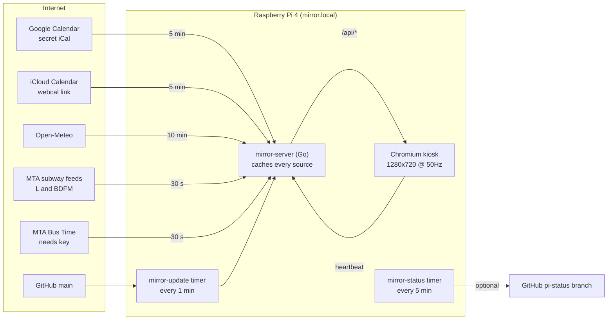
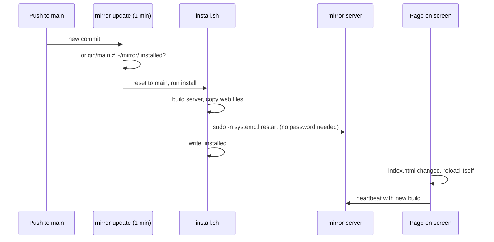

# Coconut Kitchen

A magic mirror for Fred and Ally. A 24" monitor, a Raspberry Pi 4, and one quiet
page: the day drawn as terrain, what's on both calendars, the weather, and when
the next trains leave. It runs on its own, updates itself from GitHub, and can
tell you it's healthy without anyone walking over to look.

## What's on the screen

| Part | What it shows | Source | Refresh |
|---|---|---|---|
| Date line | Time, weekday, date, weather | Open-Meteo (no key) | 10 min |
| Headline | One observational sentence about the day | Built from the calendar | with calendar |
| Terrain | The day as a landscape: Fred solid, Ally dashed, 6 am to midnight | Calendar events | with calendar |
| Three acts | Morning, afternoon, evening in a few words | Calendar events | with calendar |
| Today / Tomorrow | Numbered lists, with whose calendar each is on | Google (Fred) + iCloud (Ally) | 5 min |
| Getting around | L both ways at Myrtle–Wyckoff, M to Manhattan at Forest Av, B13 both ways at Gates/Fairview | MTA GTFS-realtime, MTA Bus Time | 30 s |
| Minimap | A small round map around home: the M and L, three stations, and a dot for every train or bus heading to your stops, with its minutes. A hollow mark means it hasn't left the start of the line yet | Same feeds, streets from OpenStreetMap | 15 s |
| Night mode | Same page, dark palette, dimmer | Clock | 10 pm to 5 am |

```mermaid
gantt
    title A day on the mirror
    dateFormat HH:mm
    axisFormat %H:%M
    section Scene
    Night (dark, dim)   :00:00, 5h
    Day (light terrain) :05:00, 17h
    Night (dark, dim)   :22:00, 2h
    section Terrain axis
    Drawn hours          :06:00, 18h
    section Rain note
    Shown if rain is due :05:00, 13h
```



## How it fits together



Each source sits behind a small cache. If a fetch fails, the screen keeps the
last good answer, and `/api/status` records the error. One broken calendar
doesn't hide the other.

## How updates reach the Pi



The frontend is prebuilt in `frontend/dist`, so the Pi never needs Node. If an
install fails, `.installed` isn't written and the next minute tries again.
Anyone who can push to `main` changes what runs on the Pi, so keep push access
to yourself.

## Checking on it

From any SSH session (Termius on home WiFi, or Raspberry Pi Connect from anywhere):

```
mirror-status
```

```
✓ Server running
✓ Browser on screen
✓ Page checking in            seen 12s ago
✓ Screen shows the installed build
✓ Up to date with GitHub
✓ Last auto-update            success
✓ Calendars                   Fred 6, Ally 2
✓ Weather
✓ L to Manhattan              3, 11, 19 min
✓ L to Canarsie               5, 14 min
✓ M to Manhattan              7, 19 min
✓ Transit visible on screen   3 rows
✓ Power                       throttled=0x0, 48.2°C
```

`mirror-status --json` gives the same as JSON.

To have the Pi publish this every 5 minutes (so Claude can read it without SSH),
run once: `bash ~/mirror/report-setup.sh`. It makes a deploy key; add it to the
repo with write access. Reports go to the `pi-status` branch and contain counts
and health only, never event titles, calendar links, or API keys.

### Other handy commands

| Do this | Command |
|---|---|
| Update now instead of waiting | `bash ~/mirror-src/update.sh` |
| Server logs | `journalctl -u mirror -n 50` |
| Update logs | `journalctl -u mirror-update -n 30` |
| Restart the server | `sudo systemctl restart mirror` |
| Change display mode | `MODE=1280x720@50Hz bash ~/mirror/setup-pi.sh` |
| Rotate for vertical | `ROTATION=90 bash ~/mirror/setup-pi.sh` then `sudo reboot` |
| Edit settings | `nano ~/mirror/config.json` then restart the server |

## Set up a fresh Pi

On 64-bit Raspberry Pi OS with SSH turned on:

```
curl -fsSL https://raw.githubusercontent.com/Haugf/coconut-kitchen/main/bootstrap.sh | bash
```

This clones to `~/mirror-src`, installs into `~/mirror`, sets up the kiosk and
timers, and reboots. Then fill in `~/mirror/config.json`.

## Settings (`~/mirror/config.json`)

Never committed. Treat calendar links and keys like passwords.

```json
{
  "weather": { "latitude": 40.7044, "longitude": -73.9018 },
  "calendar": {
    "people": [
      { "name": "Fred", "icsUrls": ["https://calendar.google.com/…/basic.ics"] },
      { "name": "Ally", "icsUrls": ["webcal://p…-caldav.icloud.com/published/2/…"] }
    ]
  },
  "map": { "home": { "address": "your street address, Ridgewood, NY 11385" } },
  "transit": {
    "busApiKey": "",
    "bus": [
      { "route": "B13", "stopCode": "", "label": "Ridgewood", "stopName": "Gates Av / Fairview Av" },
      { "route": "B13", "stopCode": "", "label": "Crescent St", "stopName": "Gates Av / Fairview Av" }
    ]
  }
}
```

- **Fred's calendar:** Google Calendar on the web > Settings > the calendar > "Secret address in iCal format".
- **Ally's calendar:** iPhone Calendar > Calendars > (i) next to the calendar > Public Calendar > Share Link.
- **Minimap:** put your address under `map.home.address` and restart the server. The Pi looks it up once and keeps it in `~/mirror/map-home.json`. Without it the map centres on Forest Av. Trains are placed between stations from their arrival times (the subway feed has no GPS); buses are real GPS once the Bus Time key is in.
- **B13:** get a free key at register.developer.obanyc.com, then look up the two stop codes at Gates Av / Fairview Av on bustime.mta.info. The subway rows work with no key.

## Repo layout

```
backend/    Go server: calendar, weather, transit (hand-rolled GTFS-rt parser), status
frontend/   Vite + React + TS. The terrain page lives in src/widgets/terrain/
deploy/     setup-pi.sh, mirror-status.sh, push-status.sh, report-setup.sh
bootstrap.sh, install.sh, update.sh
```

## Live messages

Anything on the home network can put text on the mirror:

```
curl -X POST http://mirror.local:8080/api/events \
  -H 'Content-Type: application/json' \
  -d '{"text":"Laundry is done","source":"Home","ttl":30}'
```

Set `eventsToken` in config.json to require `Authorization: Bearer <token>`.
